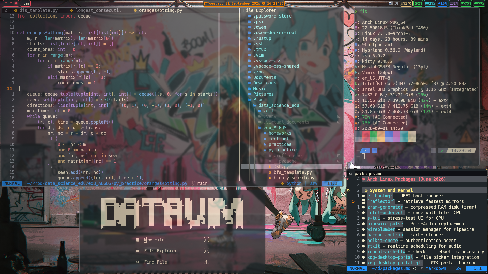
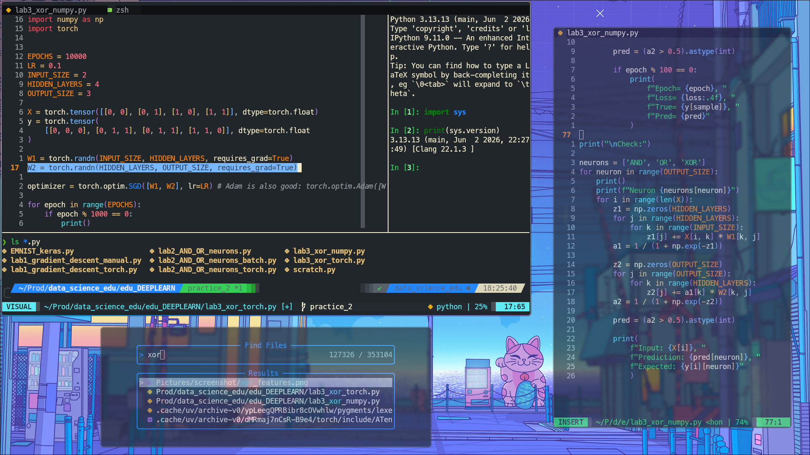

# Manuscript.nvim

A calm, dark Neovim colorscheme with warm paper-like accents.  
It uses a cool slate background (#20262a) and soft ivory text (#f2ecce), inspired by Kanagawa and GitHub Dark Dimmed.

## What you need

- Neovim 0.10 or newer
- A plugin manager (lazy.nvim recommended)
- Optional: nvim-treesitter for better syntax highlighting

## Installation with lazy.nvim

1. Open your Neovim config folder (usually ~/.config/nvim/).
2. Add this to your plugin list (for example in lua/plugins/manuscript.lua):

       {
         "dimvoe/manuscript.nvim",
         lazy = false,
         priority = 1000,
         config = function()
           vim.cmd.colorscheme("manuscript")
         end,
       }

3. Restart Neovim or run `:Lazy sync` inside Neovim.

After that, the theme will be applied automatically.

## Manual activation

You can also set the colorscheme at any time with:

    :colorscheme manuscript

## Recommended

Install [nvim-treesitter](https://github.com/nvim-treesitter/nvim-treesitter) and enable highlighting to get the full experience.

## Extras
### Kitty terminal

Copy the colors from extras/kitty/kitty.conf to your Kitty config (~/.config/kitty/kitty.conf) to match your terminal with the Manuscript palette.
### Waybar

Use extras/waybar/style.css as a base for your Waybar style. Place it in ~/.config/waybar/style.css or integrate the relevant CSS blocks into your own config.
### Hyprland

A ready-to-use snippet is available in extras/hypr/theme-snippet.lua.
Copy its contents into your Hyprland Lua config to apply the Manuscript colors, borders, blur, and transparency.

## Credits

Inspired by:
- [Kanagawa](https://github.com/rebelot/kanagawa.nvim)
- [GitHub Dark Dimmed](https://github.com/primer/github-vscode-theme)

## License

MIT
